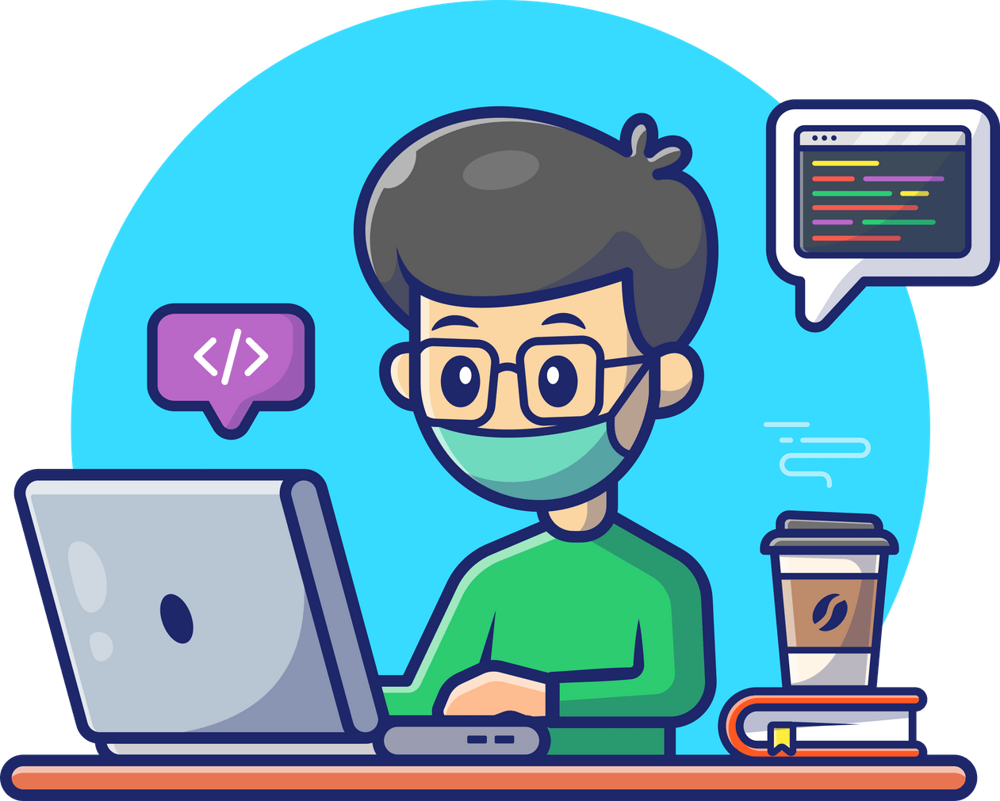

<h1 align="center">Hi 👋, I'm Joseph</h1>

  

- 🔭 I’m currently working on [1000WORDS](https://github.com/chowjiaming/1000WORDS)

- 🌱 I’m currently learning [Signals](https://preactjs.com/guide/v10/signals/) and [tRPC](https://trpc.io/)

- 👨‍💻 All of my projects are available at [josephchow.dev](https://josephchow.dev)

- 📫 How to reach me **contact@josephchow.dev**

## 🙋‍♀️ Let's Connect

  
	
	
	

